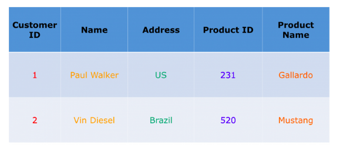

## Introducción

Apache HBase es una base de datos NoSQL de tipo columnar, Open Source, que se construye sobre HDFS (*Hadoop Distributed File System*) y que permite almacenar grandes colecciones de datasets de una forma distribuida, escalable y tolerante a fallos.

HBase está desarrollado en Java y se inspira en *Bigtable* de Google


### ¿Qué es una base de datos columnar o *wide column store*?

Es un tipo de base de datos NoSQL que almacena los datos en columnas en lugar de filas, con el objetivo de poder leer y escribir datos de manera eficiente, acelerando el tiempo que se tarda en devolver el resultado de una consulta.

Algunas BBDD columares son HBase, Cassandra o Bigtable.

* Ejemplo de base de datos orientada a filas:



* Ejemplo de base de datos orientada a columnas, como HBase:


## ¿Cuándo usar HBase?

* Cuando tenemos datasets MUY grandes (millones/billones de filas y columnas), y necesitamos lecturas y escrituras rápidas.
* Cuando los datos se reciben de diferentes orígenes de datos y estos están semi o no estructurados (no como en una RDBMS).
* Cuando tenemos muchas versiones de un dataset y queremos almacenarlas todas.
* HBase está diseñado para tener lecturas y escrituras consistentes. Es decir, una vez que se realiza una escritura, todas las lecturas sobre ese dato devolverán el mismo valor. Esto es algo que Cassandra no cumple, es eventualmente consistente.
* Cuando queremos replicación de las tablas, para hacer frente a caídas.
* No es la mejor opción para aplicaciones transaccionales o de analíticas relacionales, con queries complejas.


## Estructura de HBase

* **Table:** HBase organiza los datos en tablas.
* **Row:** Los datos se almacenan en filas. Cada fila se identifica unívocamente mediante su *row key*. Las *row keys* no tienen tipos, siempre se crean como un array de bytes.
* **Column Family:** Los datos de una fila se agrupan en *column families*. Esta agrupación afecta también en la forma en la que HBase almacena físicamente los datos. Las familias de columnas se definen en el momento de crear la tabla, porque después es muy complicado modificarlas. Todas las filas de la tabla tienen las mismas familias de columnas.
* **Column qualifier:** dentro de una familia de columnas tenemos las columnas o *column qualifier*. A diferencia de las familias de columnas, estas no se definen en el momento de crear la tabla, y no tienen que ser las mismas para todas las filas.
* **Cell:** la combinación de *row key*, *column family* y *column qualifier* identifica una *cell*. Las celdas no tienen tipo de dato, se tratan como un array de bytes.
* **Timestamp:** los valores de una celda están versionados. Por defecto, el número de versiones almacenado son 3.


A veces es más fácil entender el modelo de datos como un *map* multidimensional.


## Arquitectura de HBase

HBase tiene como componentes principales:
* HMaster Server
* HBase Region Server
* Zookeeper

Cada región contiene todas las filas entre el *row key* inicial y el final, definidos para dicha región.


La arquitectura consiste en los siguientes componentes principales:

### HMaster

Actúa monitorizando todos los *Region Server* del cluster, asignandoles las regiones y como interfaz para todos los cambios en metadatos. 
- Asignación de regiones
- Load balancing
- Recuperación de Region Servers

### HBase Regions Servers
En los Region Servers se sirven los datos.


## Comandos sobre HBase


Para conectarnos a HBase mediante shell, ejecutamos `hbase shell` en la máquina donde esté instalado HBase.


### Comandos para gestionar tablas

* Crear tabla: `create 'tablename', 'columnfamilyname'`.

```
 create 'flights', 'operationalInfo', 'departureInfo' 
```

* List de tablas: `list`.
* Mostrar información de una tabla: `describe 'tablename'`.
* Deshabilitar una tabla: `disable 'tablename'`.
* Borrar tabla: `drop 'tablename'`. Previamente hay que deshabilitarla.

### Comandos sobre datos de tablas

Las consultas sobre tablas de HBase se realizan con 3 métodos: *Get*, *Put* y *Scan*.

*Get* y *Put* necesitan que especifiques un *row key*. *Scan* consulta sobre un rango de filas, que puede ser definido por un *row key* inicial y final, o toda la tabla si no se especifican estos valores.

* **Get:**   `get 'tablename', 'rowname', {parametros adicionales...}`. Devuelve una sola fila. Los parámetros adicionales son, por ejemplo, TIMERANGE, TIMESTAMP, VERSIONS y FILTERS.

```
get 'flights', 'id-myflightid', {COLUMN => 'operationalInfo'}
get 'flights', 'id-myflightid', {COLUMN => ['operationalInfo', 'departureInfo']}
get 'flights', 'id-myflightid', {TIMESTAMP => [ts1, ts2]}
```

* **Put:**   `put 'tablename', 'rowname', 'columnfamily:columnvalue', 'value'`. 

* **Scan:**   `scan 'tablename', {parametros opcionales...}`.

```
scan 'flights', {COLUMNS => ['operationalInfo', 'departureInfo'], LIMIT => 10, STARTROW => 'xyz'}
```

* **Count:**   `count 'tablename', CACHE =>1000`.
* **Delete:**   `delete 'tablename','rowname','columnname'`.
* **Delete all:**   `deleteall 'tablename', 'rowname'`.
* **Truncate:**   `truncate 'tablename'`


## Diseño de tablas en HBase

El diseño de tablas para una base de datos columnar como HBase es diferente de una tabla de un modelo relacional.

Es útil hacerse las siguientes preguntas:
* ¿Cuál debe ser la estructura de la *row key* y qué debe contener?
* ¿Cuántas *column families* debe tener la tabla?
* ¿Qué datos contendrá cada *column family*?
* ¿Cuántas columnas tendrá cada *column family*?
* ¿Cuáles deben ser los nombres de las columnas? Aunque no se definan en tiempo de creación de la tabla.
* ¿Qué información debe contener las celdas?
* ¿Cuántas versiones deben almacenarse para cada celda?

Lo más importante a definir es la estructura de la *row key*. Para ello, hay que definir previamente cómo se va a leer y escribir en la tabla. Para definir el esquema, es importante conocer las siguientes propiedades acerca de HBase:

* La indexación se realiza solo sobre la *key*.
* Las tablas se almacenan según su *row key*. Cada región en la tabla es responssable de parte del espacio de *row keys*.
* Todo en HBase se almacena como array de bytes. No hay tipos.
* La atomicidad se garantiza a nivel de fila. No hay atomicidad garantizada entre filas (no hay transacciones multifila).
* Las *column qualifiers* son dinámicas y pueden ser definidas en tiempo de escritura.


## Ejemplo: Twitter

Vamos a tratar de modelar las relaciones de Twitter (usuarios siguiendo a otros usuarios), utilizando tablas de HBase.

El primer paso es definir los patrones de acceso desde la aplicación, es decir, cómo vamos a leer y escribir en la tabla.

* Patrones de lectura:
    1. ¿A quién sigue un usuario?
    2. ¿Sigue un usuario concreto "A" a un usuario concreto "B"?
    3. ¿Quién sigue a un usuario concreto "A"?

* Patrones de escritura:
    1. Hacer *follow*: un usuario comienza a seguir a otro.
    2. Hacer *unfollow*: un usuario deja de seguir a otro.

### Twitter: Opción 1

Una tabla que almacene, en una fila, una lista de usuarios siendo seguidos por un usuario concreto.

La *row key* es el ID del usuario seguidor, y cada columna contiene el ID del usuario siendo seguido.


Este diseño funciona bien para el primer patrón de lectura. También soluciona el segundo, aunque puede ser costoso si la lista de usuarios seguidos es muy larga, porque debe recorrerla entera.

Añadir followers es más complicado. Para saber cuál es la cuenta de usuarios tenemos que recorrer toda la fila, y eso es costoso. 

Una solución es mantener un contador en una columna.


Y los pasos necesarios para añadir un nuevo usuario a la lista de usuarios seguidos:


Sin embargo, este diseño tiene sus problemas. Para hacer *unfollows* es costoso porque hay que leer toda la fila para encontrar qué columna borrar. Y también hay que actualizar la cuenta.

Y el mayor problema es en el *follow*, ya que hay que implementar algún tipo de lógica transaccional en el cliente, porque HBase no permite transacciones entre filas o entre llamadas RPC.

### Twitter: Opción 2

Como hemos visto, las *column qualifiers* son dinámicos y se almacenan como array de bytes, por lo que podemos poner cualquier dato en ellas.

En este diseño no vamos a necesitar llevar una cuenta, por lo tanto los *follows* y *unfollows* son más sencillos.


Esto nos soluciona casi todos los casos de patrones planteados. Quedaría el patrón 3 de lectura: ¿quién sigue a un usuario concreto "A"?.

En este caso, como el indexado solo secolumnfamily:columnvaluehace en la *row key*, sería necesario hacer un *full table scan*.

Aquí hay dos opciones:
* Mantener otra tabla que contenga la columnfamily:columnvalueista invertida (un usuario y una lista de quiénes le siguen).
* Usar la misma tabla, cambiando la *rcolumnfamily:columnvaluew key*, como en la siguiente imagen.


Aquí, la *row key* contiene el *follower* y *followed*. Ahora, obtener una lista de usuarios seguidos se convierte en un *Scan* en vez de un *Get*. Y los *Get*s ahora son *Scan*s pero de longitud 1.

Para hacer *unfollow* o contestar la pregunta ¿El usuario "A" sigue a "B"? se convierte en una operación *Delete* o *Get*, sin tener que iterar por la lista entera de usuarios en la fila.


